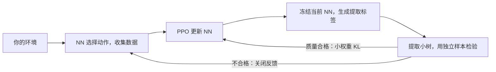

# RCPD Core：让神经网络与可读程序一起学习

这个项目把 **NN（神经网络）** 的动作规律提取成一棵能阅读的条件树，再让这个**程序**轻轻约束 NN 的训练。**PPO** 是根据环境奖励更新 NN 的强化学习方法。环境和奖励由你提供；这里没有配送环境、网页、模型或实验数据。



## 1. 安装，先跑一个小例子

需要 Python 3.10 或更新版本。在终端执行：

```bash
git clone --single-branch --branch core --depth 1 https://github.com/zhangyuang95-a11y/XAI.git XAI-core
cd XAI-core
python3 -m venv .venv
source .venv/bin/activate
python3 -m pip install -e '.[test]'
python3 -m examples.minimal_demo
```

例子不需要环境：它用合成数据给当前小型 NN 提取程序，然后做**一次真实梯度更新**。屏幕显示一致率、参数变化和条件路径，文件保存在 `output/demo/`。这只是接口演示，不是强化学习效果证明。

## 2. 每个文件怎么用

一般读者先跑例子，再打开接口模板；研究算法时再读 `core/`。

| 文件 | 做什么 / 什么时候打开 | 能否直接运行 |
|---|---|---|
| `README.md` | 安装、使用步骤 | 否 |
| `pyproject.toml` | 依赖和安装配置；增加依赖时改 | 用上面的 pip 命令 |
| `.gitignore` | 防止输出、模型和缓存进入 Git | 否 |
| `core/__init__.py` | 对外导入 `RCPD`、配置、程序 | 导入使用 |
| `core/interfaces.py` | 环境规格、状态、动作和特征契约 | 导入使用 |
| `core/rcpd.py` | 提取、评价、周期与质量门控 | 导入使用 |
| `core/rcpd_config.py` | 提取深度、复杂度、保真度等参数 | 导入使用 |
| `core/rcpd_tree.py` | 样本划分、树构造、候选选择 | 内部模块 |
| `core/program.py` | 执行条件树、路径记录、JSON 保存加载 | 通过下方 explain 命令 |
| `core/policy_program_regularizer.py` | KL 与复杂度工具；保留原低层 API | 导入使用 |
| `training/__init__.py`、`examples/__init__.py` | Python 包标记 | 不需修改 |
| `training/networks.py` | 两层128单元共享 Actor、集中式 Critic | 导入使用 |
| `training/rollout.py` | 收集交互，计算回报和优势 | 内部模块 |
| `training/ppo.py` | PPO 小批次更新和反馈梯度 | 内部模块 |
| `training/feedback.py` | **唯一训练反馈入口**：当前 NN 标签、独立验证、固定程序、KL | 内部模块 |
| `training/checkpoint.py` | 原子保存、恢复网络/优化器/随机数/环境 | 内部模块 |
| `training/runner.py` | 训练循环、导出和查看路径 | `python3 -m training.runner` |
| `configs/default.yaml` | 改训练步数、学习率、反馈门槛 | 用 `--config` 传入 |
| `examples/minimal_demo.py` | 无环境的小型闭环示例 | `python3 -m examples.minimal_demo` |
| `examples/adapter_template.py` | 接入自己环境的模板；必须填写 | 填写后作为工厂使用 |
| `tests/__init__.py` | 测试包标记 | 不需修改 |
| `tests/tiny_env.py` | 仅供测试的微型环境 | 测试自动调用 |
| `tests/test_training.py` | 检查 PPO、提取、续训、命令行 | `python3 -m pytest -q` |

## 3. 接入你自己的环境

复制 [接口模板](examples/adapter_template.py) 为 `my_adapter.py`，实现以下方法；**原模板故意报未实现，不能直接训练**。

- `spec`：智能体数量、观察/共享状态尺寸，以及**有顺序的**观察名、特征名和动作名。名称、顺序、归一化变化时更新 `version`。
- `reset(seed)`：返回每个智能体的观察和共享状态。
- `step(actions)`：执行动作，返回奖励、结束信息和执行前提交的动作。`terminated` 是真正终局；`truncated` 是时间限制。必须返回**重置前的最后状态**，不要内部自动 reset。
- `features(frame, agent)`：按 `feature_names` 顺序返回具名数值，只使用已公开信息。特征命名空间用于分组；关系特征用 `interaction.` 前缀。任务语义、动作含义由适配器定义。
- `make_env()`：返回适配器实例。
- 可选 `snapshot()` / `restore()`：必须完整保存环境、搭档、历史与其随机数。缺少时只能新实验初始化，不能完整续训。

数组尺寸见 [interfaces.py](core/interfaces.py)。支持单智能体和固定数量多智能体，离散动作；多智能体需同步结束/重置。共享 Actor 使用角色特征，Critic 使用共享状态和角色。奖励不由本库设计；团队奖励可以给双方相同值。

有外部控制器时，该动作的 `actor_mask` 必须为 `False`，即使它恰好与 NN 选择相同。这些动作不参与 Actor 更新；环境撞墙后没移动不等于外部改选。提取标签仍全部来自当前 NN。

## 4. 训练、停止、续训

实现模板后，在项目根目录运行（`my_adapter` 是你实现的文件）：

```bash
python3 -m training.runner train --factory my_adapter:make_env --config configs/default.yaml --output output/run --device cpu
```

Apple 芯片可改 `--device mps`，NVIDIA 可改 `--device cuda`，也支持 `auto`。默认上限500,000联合步：所有机器人共同执行一回合，算一个联合步。不是每个机器人各算一次。

按 **Ctrl+C 一次**，当前采样/更新结束后保存 `last.pt` 并退出。可加 `--max-steps 100000` 或 `--max-minutes 30` 限制运行；不会自动无限续训。时间限制在批次边界检查，可能略超出一个批次及保存时间。

```bash
python3 -m training.runner train --factory my_adapter:make_env --config configs/default.yaml --output output/run --resume output/run/last.pt --device cpu
```

到达原上限后，想继续需显式加 `--max-steps 750000`。完整续训要求同一配置、设备与接口，只有总步数/时限可改。没有环境快照时，显式开始新实验，只继承网络参数、计数归零：

```bash
python3 -m training.runner train --factory my_adapter:make_env --config configs/default.yaml --output output/new_run --initialize output/run/last.pt --device cpu
```

新实验输出目录必须为空。只加载可信的 checkpoint；它包含 Python 序列化对象。

## 5. 导出程序、查看解释路径

训练产生提取程序后：

```bash
python3 -m training.runner export --checkpoint output/run/last.pt --output output/program.json
```

没有通过反馈门槛的程序也可供诊断导出，不能因此称为合格解释。没有提取过程序则会明确报错。下面命令可在最小例子后直接运行：

```bash
python3 -m training.runner explain --program output/demo/program.json --features output/demo/features.json
python3 -m pytest -q
```

查看自己环境时，将这两个路径换为自己的程序与具名特征 JSON。

## 6. 输出与边界

- `last.pt`：网络、优化器、随机数、计数、程序、反馈与可选环境快照。
- `config.json`、`signature.json`：实际参数与接口顺序。
- `metrics.jsonl`：PPO 损失、KL、反馈梯度大小与更新次数。
- `program.json`、`extraction.json`：最近程序与质量报告、程序哈希。例子额外输出 `features.json`、`trace.json`、`metrics.json`。

训练目标为 `PPO Actor loss + λ × KL(NN || program)`，默认 λ=0.01、上限0.05。默认热身10,000步，每5,000步尝试提取，一致率≥0.90且平均KL≤0.10才启用。数据不足/质量不足时继续 PPO，不让程序接管动作。每轮间程序固定；Actor 参数仍会变化。未加任务特定能力门槛，接入者需要独立验证任务表现。

程序有深度/叶数/特征数上限，复杂度参与**候选程序选择**和报告，不是可直接对 Actor 求梯度的树结构损失。条件路径是近似策略证据，不是 NN 的真实内部思考。高一致率也不保证任务表现、因果解释正确或对人有帮助。

特征内容哈希固定划分外层提取训练/验证集，同样的特征不会跨集；外层验证不参与特征选择或候选拟合。训练集内部继续保留原算法的候选划分。连续状态仍可能相关，这不是独立任务最终测试；接入者需另留最终测试集。CPU 测试覆盖了精确续训，设备间不承诺逐位相同结果。

### 从旧项目迁移了什么

来源：XAI 的 `83ce2ef223d9476b7c166ce8a0df288b077d73a0` 中 `core/`。保留原有有界回归树、软 NN 分布标签、候选复杂度选择、保真度评价、程序JSON和条件路径；去掉根据物流特征名称自动推断含义的逻辑，改为适配器命名空间和显式语义组。动作上下文绑定改为显式 `action_context_roles` 元数据。

原低层 `PolicyProgramRegularizer` 含 `λKL + 离散复杂度常量`；原专用 `FeedbackManager` 另含仓库动作数量、能力分数/参照分数、暖启动与退化门槛。本分支不复制仓库封装，统一通过 `training/feedback.py` 接入原 `RCPD.fit` 与核心 KL。默认使用原始程序分布、小权重上限、暖启动和独立验证质量门槛；不沿用领域专用能力门槛、正优势/动作一致筛选或额外奖励。旧低层 API 保留用于研究，通用训练不调用另一套反馈损失。以上是明确的集成变化，不声称与历史训练轨迹完全等价。

`core` 是独立根提交，只清理本分支；同一 GitHub 仓库其他分支仍含原文件。请使用上面的单分支浅克隆命令。源项目所检查文件中没有独立 LICENSE，本分支未擅自新增许可证；对外使用授权请联系作者。

本次验证：CPU 下13项测试通过；另在不含原应用目录的空目录安装构建包，成功导入并运行最小示例。未执行正式环境训练，未验证任何任务行为改善；MPS/CUDA 提供设备入口，本次未实测其数值一致性。
